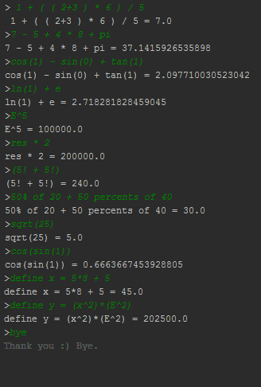

# Scalarith

<h1 style="text-align:center">

</h1>

A basic expression interpreter made with Scala.

This project has been made in order to train the basics of Parsing with Scala.

This expression parser supports :
- The four basic operations : + \ - \ * \ /
- The power operation : x^y 
- The parenthesis priority : (a+b)*c
- The operations priority : multiplication and division have priority over addition and substraction
- The trigonometry functions : cos() / sin() / tan() / arcos() / arcsin() / arctan()
- The exponential function : e^x
- The ln function : ln(x)
- The square root function: sqrt(x)
- The factorial : x!
- The power of 10 operator : 1*E^5 = 1 * 10 ^5 = 100 000
- The imbricated functions : cos ( sin ( tan ( cos ( 0 ) ) ) ) ^ E^(5*6)
- Classical constants : pi 
- Convenient way of computing percentages : x % of y => 28% of 50 = 14
- Memory of the last operation : res => 2 * 5 = 10 ; res * 2 = 2 * 10 = 20
- Variables definition : define x = 5 => x is reusable
